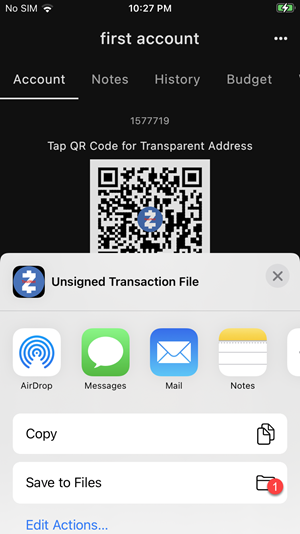
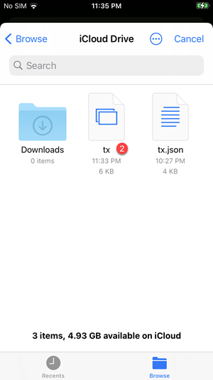

In a cold storage transaction, the mobile account does not have
the secret key needed for spending.
However, it is able to build an unsigned transaction and export
it as a file.

The account owner moves the file to another computer that holds
the secret key (preferably offline and air-gapped for security).

On the offline computer, he signs the transaction and generate
a now valid transaction that he saves to another file.

After importing the later into the Y/ZWallet, the transaction
is finalized and broadcast.

This workflow ensures that the secret key never leave the computer
that is isolated from the Internet.

[Cold Storage in the context of Bitcoin](https://en.bitcoin.it/wiki/Cold_storage)

The same concept is applicable to Zcash.

## Preparing the unsigned transaction

If the account does not have a secret key either because it was restored
from viewing key or because it was converted to Cold Storage,
the button Send is dimmed. Instead of signing and broadcasting a transaction,
the Send page prepares an unsigned transaction.

Depending on your phone OS, you can save the unsigned transaction to
a USB key, or to the Cloud.

The transaction file must be copied to the computer that has the `sign`
application.




## Sign

You can build the `sign` app its [source code](https://github.com/hhanh00/zcash-sync)

To run `sign` app, you need to create an `.env` file that has
a line

```
KEY="<seed or secret-key>"
```

For example,

```
KEY="human tissue pony dose host stamp tag hockey begin wisdom humble divorce goose grief analyst hard axis fiscal flat cloud huge pair sunset into"
```

Then run the signer as follows:

```sh
sign <unsigned filename> <signed filename>
```

For example,

```sh
sign tx.json tx.raw
```

Then copy `tx.raw` back to USB drive (or Cloud storage)

## Broadcast





1. Select "Broadcast" from the app menu
2. Pick up the raw transaction file from storage
3. Wait for the tx id

## Notes

- USB drive is safer that Cloud storage but in any case, the files
do not contain any information that could be used to reveal your secret key
